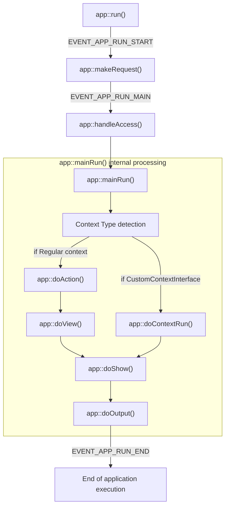

# Application Lifecycle

## Application run

The application lifecycle is started by initializing a new app instance and calling the ::run() method:

~~~php
(new \codename\example\app())->run();
~~~

The following execution steps (including sent hooks/events) are performed:

- (*event*) hook::EVENT_APP_RUN_START
- app::**makeRequest()**
- (*event*) hook::EVENT_APP_RUN_MAIN
- app::**handleAccess()**
- app::**mainRun()**
    - if context is an instance of **customContextInterface**
        - app::**doContextRun()** (executes context instance's ::run() method)
    - otherwise, regular context
        - app::**doAction()** (executes the requested **action**)
        - app::**doView()** (executes the requested **view** or falls back to default view)
    - app::**doShow()** (renders content using templateengine)
    - app::**doOutput()** (outputs content via response instance)
- (*event*) hook::EVENT_APP_RUN_END
- exit/return

[![](https://mermaid.ink/img/eyJjb2RlIjoiZ3JhcGggVERcbiAgYXBwX3J1bltcImFwcDo6cnVuKClcIl1cbiAgbWFrZV9yZXF1ZXN0W1wiYXBwOjptYWtlUmVxdWVzdCgpXCJdXG4gIGhhbmRsZV9hY2Nlc3NbXCJhcHA6OmhhbmRsZUFjY2VzcygpXCJdXG4gIG1haW5fcnVuW1wiYXBwOjptYWluUnVuKClcIl1cbiAgZW9hW1wiRW5kIG9mIGFwcGxpY2F0aW9uIGV4ZWN1dGlvblwiXVxuXG4gIGRvX2NvbnRleHRfcnVuW1wiYXBwOjpkb0NvbnRleHRSdW4oKVwiXVxuICBkb19hY3Rpb25bXCJhcHA6OmRvQWN0aW9uKClcIl1cbiAgZG9fdmlld1tcImFwcDo6ZG9WaWV3KClcIl1cbiAgZG9fc2hvd1tcImFwcDo6ZG9TaG93KClcIl1cbiAgZG9fb3V0cHV0W1wiYXBwOjpkb091dHB1dCgpXCJdXG5cbiAgYXBwX3J1bi0tPnxFVkVOVF9BUFBfUlVOX1NUQVJUfCBtYWtlX3JlcXVlc3RcbiAgbWFrZV9yZXF1ZXN0LS0-fEVWRU5UX0FQUF9SVU5fTUFJTnwgaGFuZGxlX2FjY2Vzc1xuICBoYW5kbGVfYWNjZXNzLS0-bWFpbl9ydW5cblxuICBzdWJncmFwaCBtYWluX3J1bl9pbnRlcm5hbFtcImFwcDo6bWFpblJ1bigpIGludGVybmFsIHByb2Nlc3NpbmdcIl1cbiAgICBtYWluX3J1bi0tPmNvbnRleHRfdHlwZVtcIkNvbnRleHQgVHlwZSBkZXRlY3Rpb25cIl1cbiAgICBjb250ZXh0X3R5cGUtLT58aWYgUmVndWxhciBjb250ZXh0fCBkb19hY3Rpb25cbiAgICBjb250ZXh0X3R5cGUtLT58aWYgQ3VzdG9tQ29udGV4dEludGVyZmFjZXwgZG9fY29udGV4dF9ydW5cbiAgICBkb19hY3Rpb24tLT5kb192aWV3XG4gICAgZG9fdmlldy0tPmRvX3Nob3dcbiAgICBkb19jb250ZXh0X3J1bi0tPmRvX3Nob3dcbiAgICBkb19zaG93LS0-ZG9fb3V0cHV0XG4gIGVuZFxuXG4gIGRvX291dHB1dC0tPnxFVkVOVF9BUFBfUlVOX0VORHwgZW9hIiwibWVybWFpZCI6eyJ0aGVtZSI6ImRlZmF1bHQifSwidXBkYXRlRWRpdG9yIjpmYWxzZSwiYXV0b1N5bmMiOnRydWUsInVwZGF0ZURpYWdyYW0iOmZhbHNlfQ)](https://mermaid.live/edit#eyJjb2RlIjoiZ3JhcGggVERcbiAgYXBwX3J1bltcImFwcDo6cnVuKClcIl1cbiAgbWFrZV9yZXF1ZXN0W1wiYXBwOjptYWtlUmVxdWVzdCgpXCJdXG4gIGhhbmRsZV9hY2Nlc3NbXCJhcHA6OmhhbmRsZUFjY2VzcygpXCJdXG4gIG1haW5fcnVuW1wiYXBwOjptYWluUnVuKClcIl1cbiAgZW9hW1wiRW5kIG9mIGFwcGxpY2F0aW9uIGV4ZWN1dGlvblwiXVxuXG4gIGRvX2NvbnRleHRfcnVuW1wiYXBwOjpkb0NvbnRleHRSdW4oKVwiXVxuICBkb19hY3Rpb25bXCJhcHA6OmRvQWN0aW9uKClcIl1cbiAgZG9fdmlld1tcImFwcDo6ZG9WaWV3KClcIl1cbiAgZG9fc2hvd1tcImFwcDo6ZG9TaG93KClcIl1cbiAgZG9fb3V0cHV0W1wiYXBwOjpkb091dHB1dCgpXCJdXG5cbiAgYXBwX3J1bi0tPnxFVkVOVF9BUFBfUlVOX1NUQVJUfCBtYWtlX3JlcXVlc3RcbiAgbWFrZV9yZXF1ZXN0LS0-fEVWRU5UX0FQUF9SVU5fTUFJTnwgaGFuZGxlX2FjY2Vzc1xuICBoYW5kbGVfYWNjZXNzLS0-bWFpbl9ydW5cblxuICBzdWJncmFwaCBtYWluX3J1bl9pbnRlcm5hbFtcImFwcDo6bWFpblJ1bigpIGludGVybmFsIHByb2Nlc3NpbmdcIl1cbiAgICBtYWluX3J1bi0tPmNvbnRleHRfdHlwZVtcIkNvbnRleHQgVHlwZSBkZXRlY3Rpb25cIl1cbiAgICBjb250ZXh0X3R5cGUtLT58aWYgUmVndWxhciBjb250ZXh0fCBkb19hY3Rpb25cbiAgICBjb250ZXh0X3R5cGUtLT58aWYgQ3VzdG9tQ29udGV4dEludGVyZmFjZXwgZG9fY29udGV4dF9ydW5cbiAgICBkb19hY3Rpb24tLT5kb192aWV3XG4gICAgZG9fdmlldy0tPmRvX3Nob3dcbiAgICBkb19jb250ZXh0X3J1bi0tPmRvX3Nob3dcbiAgICBkb19zaG93LS0-ZG9fb3V0cHV0XG4gIGVuZFxuXG4gIGRvX291dHB1dC0tPnxFVkVOVF9BUFBfUlVOX0VORHwgZW9hIiwibWVybWFpZCI6IntcbiAgXCJ0aGVtZVwiOiBcImRlZmF1bHRcIlxufSIsInVwZGF0ZUVkaXRvciI6ZmFsc2UsImF1dG9TeW5jIjp0cnVlLCJ1cGRhdGVEaWFncmFtIjpmYWxzZX0)

(Mermaid source:)

The application lifecycle might be interrupted at any stage due to errors.
The context execution itself is isolated from runtime errors that do not have their origin in the context.

## Global methods and instances

The `bootstrapInstance` class provides multiple methods for the `app` class and most `context` classes:

- **getModel**(...): gets a new model instance for the given model name
- **getRequest**(): gets current request instance
- **getResponse**(): gets current response instance

### Data container

The `\codename\core\datacontainer` is an essential base class that is used for request, response, some configuration data and other instances.
A data container enables you to interact with nested data.

- **getData($key = '')**
    - Key can be *empty*/not explicitly set as argument (retrieves **all** data as associative array)
    - Key can be a regular string (retrieves this specific key)
    - Key can be separated by `>` which enables you to 'dive' into deeper object structures, e.g. `rootkey>subkey>another`
    - returns null if key was not found (or is explicitly null)
- **setData($key, $value)**
    - Key can be a regular string (sets this specific key)
    - Key can be separated by `>` which enables you to 'dive' into deeper object structures, e.g. `rootkey>subkey>another`
    - `$value` can be anything (null, primitive, instance)
- **isDefined($key)**
    - Checks whether $key is defined (`null` is interpreted as is-defined/**true**!)

### Request instance

The request instance contains data which was used calling the application. In case of a Web application, this is usually HTTP-related data (query parameters, parsed payload, binary data, etc.). In case of a CLI application, this contains the arguments the application was launched with. A request instance is a `datacontainer`, see methods above.

### Response instance

The response instance is the object that stores data to be used for output. It is meant to contain rendering parameters/base data for a template to be rendered. In case of pure REST-applications this might also contain just data to be serialized as JSON string. A response instance is a `datacontainer`, see methods above.
