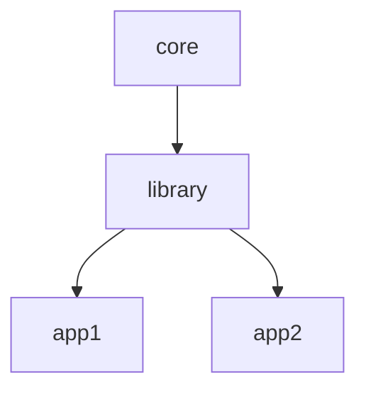

# Naming and inheritance

The core framework defines a standard that bases on PSR-4 regarding class naming and inheritance.
This also implies heavy usage of Composer-autoloading.

- For cross-project inheritable classes, we're using lowercase class names, except it is found to be appropriate for proper names (e.g. the mail driver for PHPMailer).
- It is not prohibited if it makes sense to give an advanced naming by using **camelCasing**.
- For interfaces, there is no general naming rule, but **camelCasing** mentioning ...***Interface*** last, is current practice.

The core framework establishes a secondary form of inheritance in your application.
While regular class inheritance (via extends and implements) defines the building blocks for your code, you can define and override drivers and modules in every application layer as you wish, as well as **configuration elements**, templates, translation files, etc.

As the core framework facilitates and embraces abstraction and modularization, the base namespace (e.g. in directory `backend/class/`) is divided into several 'categories' (base drivers/interfaces) for various purposes:

- auth: auth drivers implementing authInterface and/or relying on auth base class
- bucket: bucket drivers implementing bucketInterface
- database: database drivers
- mail: mail client drivers
- model: various model drivers
- request: request drivers/base classes (e.g. http or cli)
- response: response drivers/base classes (e.g. http, cli or even a specialized json-response)
- session: session drivers
- validator: validators
- etc.

This inheritance paradigm **does not** compete with regular inheritance (e.g. via *extends*), but in fact, does not make assumptions about the real inheritance tree, except the base class (or **category** it belongs to, e.g. *bucket*).

## Cross-app inheritance

The core framework enables you to override drivers, clients and classes which are compatible with the respective naming schema.

The app class itself provides you `app::getInheritedClass` which expects a string in the form of  
`bucket_ftp_special` which would translate to the partial namespace `bucket\ftp\special`.
This partial namespace is now being searched in the appstack, from top (your app) to bottom (the core framework base), see below.
The first found matching implementation is the to-be-chosen implementation.

Your application may define a file in `config/parent.app` with the content `<vendor>_<app>` that instructs the framework to directly inject this respective app into the appstack as immediate parent of your application.

## The appstack

Your application is always part of a superior structure called **the appstack**.
This appstack can be interpreted as an ordered array of application/library fragments, e.g.:

~~~php
//
// app::getAppstack() could return:
//
[
  [ 'vendor' => 'examplevendor',  'app' => 'exampleapp' ], // <-- this is your application
  [ 'vendor' => 'codename',       'app' => 'core-ui' ],
  [ 'vendor' => 'codename',       'app' => 'core' ]
]
~~~

During application init, your application injects itself into the appstack. Similarly, every extension and/or base library does.
The core framework itself is always the 'last resort' and underlying structure.

This gives you the power to:

- **Create a custom implementation of a driver class** like `\codename\core\bucket\ftp` in `\examplevendor\exampleapp\bucket\ftp`.
- **Define custom configurations** in `config/somefile.json` in multiple appstack items that *can* be merged together recursively or override each other.
- **Define inheritable views and templates** (in frontend/view/... and frontend/template/... respectively)

## Appstack items

Appstack items consist of two required properties:

- **vendor**: the vendor's name
- **app**: the app's name

By default, this is used to build a base namespace for the given app: `\<vendor>\<app\...`.

Additionally, they may define:

- **namespace**: a base namespace that differs
- **homedir**: a differing home directory (might also be relative)

## Advantage of high-level inheritance

The type of additional inheritance the core framework leverages enables you to perform additional modularization and organisational improvement in your code. For example, you might want to define a base library that defines all models and tools that could ever be needed in your application. On top of that, you **stack** two more applications separately, one for your backoffice and another one just for your customers.

(Mermaid source:)

As both 'leaf' applications might define different aspects to interact with your application and your data, both applications can have differing implementations for some parts of the ecosystem - or leave some out, completely.
At the base, both applications share their common library and its appstack.
